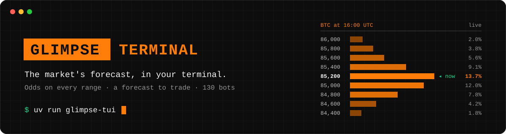
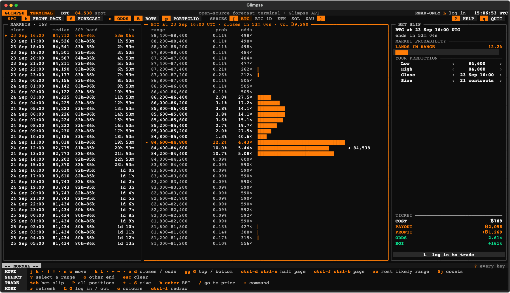
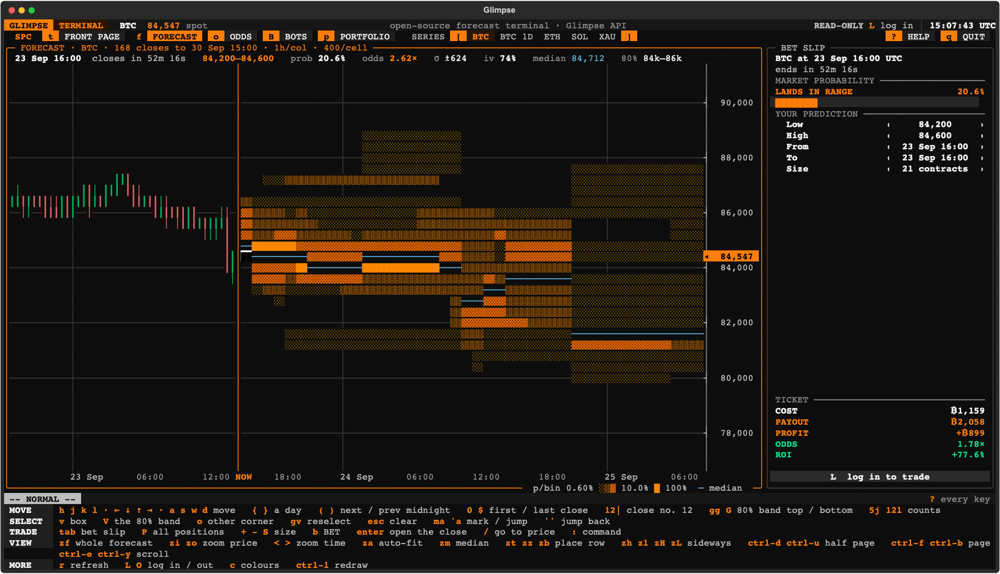
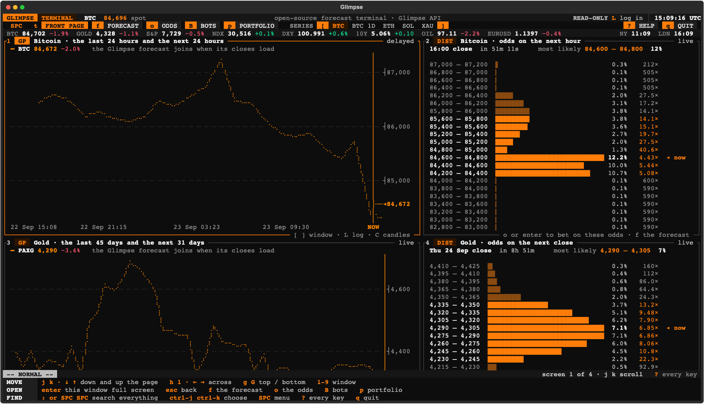
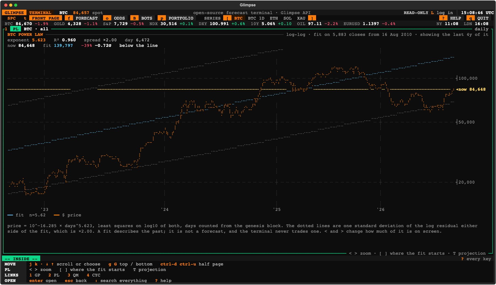
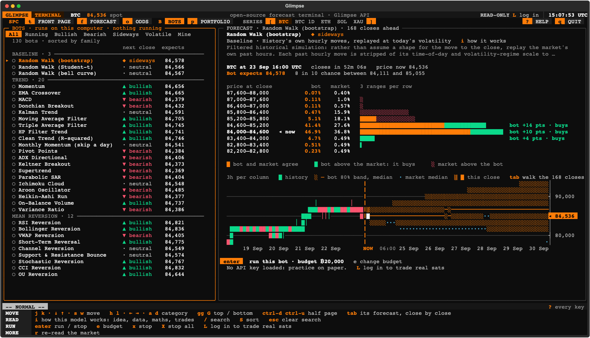
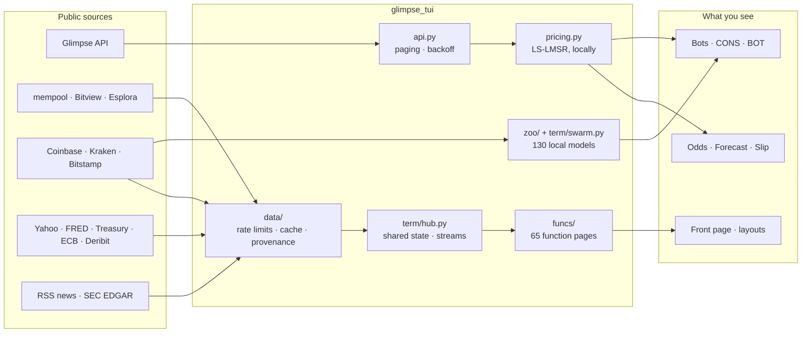

<div align="center">



<br>

**A keyboard-driven terminal for [Glimpse](https://www.glimpse.markets/forecast) prediction markets, the price forecast they add up to, and the world around them.**

[](LICENSE)
[](https://www.python.org/)
[](https://textual.textualize.io/)
[](https://docs.astral.sh/uv/)
[](https://docs.astral.sh/ruff/)
[](#development)
[](#where-the-numbers-come-from)

[What is Glimpse?](#what-is-glimpse) ·
[The forecast](#the-price-forecast) ·
[Quick start](#quick-start) ·
[Tour](#a-tour-of-the-terminal) ·
[Bots](#the-bot-zoo) ·
[Keys](#moving-around) ·
[Data](#where-the-numbers-come-from) ·
[Hacking](#development)

</div>

<br>

<p align="center">
  
  <br>
  <sub><b>The first screen.</b> Every price range for Bitcoin's next hourly close, the market's probability of each, what it pays, and the bet slip a <code>tab</code> away.</sub>
</p>

---

## ✨ Highlights

|  |  |
|---|---|
| 🎯 **Opens on the odds** | One screen covers placing a bet: every outcome of Bitcoin's next close, priced, with the cursor on the most likely range. |
| 🔥 **The forecast, as a heatmap** | A week of closes laid side by side becomes one orange cloud of probability. Box a region with `v` and trade it. |
| 🌍 **A front page for the world** | Bitcoin, gold, hashrate, the news, rates, dollar liquidity, FX and commodities on one long scrolling page. |
| 🤖 **138 bots run on your laptop** | The Glimpse Forecast Lab's model zoo computes from public candles on your own machine. Watch every bot, run one on paper, or write your own in one function. |
| 📈 **The power law** | Bitcoin's log-log regression from the genesis block, with how far today's price sits from the line. |
| ₿ **Priced in Bitcoin** | Any ticker has a satoshi form: `XAUBTC`, `SPXBTC`, `NVDABTC`. Press `$` to reprice a whole table. |
| ⌨️ **Moves like spacemacs** | Vim keys, windows and buffers, `SPC` as the leader, and `:` to search everything. |
| 🔓 **Free data, no account** | Every default source is public and keyless. Point it at your own node, or run every request through Tor. |
| 🧪 **Tested offline** | 712 tests replay recorded responses, so no test touches the network. |

---

<a id="what-is-glimpse"></a>

## 🔮 What is Glimpse?

[Glimpse](https://www.glimpse.trading) is a Bitcoin-denominated prediction market on **where a price will close.** Deposits and withdrawals go over the Lightning Network.

Most prediction markets ask a yes-or-no question. Glimpse asks for the whole shape of the future:

> **"Where will Bitcoin be at 16:00 UTC on 23 September?"**

Each close, which Glimpse calls a *market*, is cut into **500 adjacent price ranges**. Every range is a contract that pays **100 sats if the price closes inside it**, and nothing if it doesn't. So you can bet on the exact range you think the price will land in, and not only on up or down.

```
   BTC at 23 Sep 16:00 UTC                       closes in 53m
   range                 prob     odds
   85,000 – 85,200       2.0%    27.5×   ▇▇
   84,800 – 85,000       1.3%    40.6×   ▇
 ▸ 84,600 – 84,800      12.2%    4.43×   ▇▇▇▇▇▇▇▇▇▇▇▇▇▇▇▇▇▇▇▇▇▇▇▇▇▇▇▇
   84,400 – 84,600      10.0%    5.44×   ▇▇▇▇▇▇▇▇▇▇▇▇▇▇▇▇▇▇▇▇▇▇▇     ◂ now
   84,200 – 84,400      10.7%    5.08×   ▇▇▇▇▇▇▇▇▇▇▇▇▇▇▇▇▇▇▇▇▇▇▇▇▇
```

Series run back to back. `BTC` has a close every hour for the week ahead, and there are also `BTC 1D` (daily closes), `ETH`, `SOL` and `XAU` (gold, settled on PAXG).

### How prices are set

Nobody has to be on the other side of your trade. An automated market maker quotes every range at every moment using the **liquidity-sensitive logarithmic market scoring rule (LS-LMSR)**. With $q_i$ contracts outstanding on range $i$ of $n$:

$$
C(\mathbf{q}) \;=\; b(\mathbf{q})\,\ln \sum_{i=1}^{n} e^{\,q_i / b(\mathbf{q})},
\qquad
b(\mathbf{q}) = \alpha \sum_i q_i,
\qquad
\alpha = \frac{V}{n \ln n}
$$

A trade costs the change in $C$, scaled to 100 sats a contract. The price of a range is the marginal cost of one more contract. Buying a range makes it dearer and the others cheaper. On LS-LMSR the prices sum to slightly more than 100, so the terminal normalises them into the probability it shows. A 2% commission applies on buying, selling and redemption.

The public quotes endpoint rounds each price to a whole sat, which reads as zero for most of a 500-range market. The terminal therefore **recomputes every price locally from the outstanding shares.** [`pricing.py`](src/glimpse_tui/pricing.py) holds those pure functions and is short enough to read in one sitting. The [Glimpse whitepaper](https://www.glimpse.trading/whitepaper/) has the full derivation.

---

<a id="the-price-forecast"></a>

## 📊 The price forecast

Put one market's probabilities in a column. Put the next close's column beside it, then the next, for all 168 hourly closes of the coming week. **The result is a forecast:** the crowd's probability distribution for the price at every hour ahead, set by people with money on it.

<p align="center">
  
  <br>
  <sub><b>The forecast (<code>f</code>).</b> Time runs across and price runs up. The more solid the orange, the more probability the market puts on that range. Candles sit left of <code>NOW</code> and the median is in cyan.</sub>
</p>

Each character cell is one price range at one close, shaded `░ ▒ ▓ █` on a single log scale of probability. The picture reads as a shape to look at, not a colour key to decode. From here you can:

- **Read it.** The median, the 80% band, the market's implied volatility, and the odds under the cursor.
- **Select it.** `v` starts a box and `V` selects the 80% band. A box over several closes places *one order per close*, each priced at that close's own book.
- **Price it.** `tab` opens the bet slip and `P` lists every position before anything is sent: chance, contracts, cost, payout, profit, odds and ROI, with a total.
- **Trade it.** `b` bets. The confirmation *is* that table, so no order goes out that you haven't seen priced line by line.

`OMON` reads the same distributions as an options chain: digital calls, puts and ranges on each close, an implied volatility from a lognormal fit, and the Greeks. `GIV` compares Glimpse's implied volatility with Deribit's.

---

<a id="quick-start"></a>

## 🚀 Quick start

You need Python 3.12+ and [uv](https://docs.astral.sh/uv/). No account, API key or config file is needed to look around.

```sh
# run it straight from GitHub
uv tool install git+https://github.com/BIRKELAND-GLIMPSE/glimpse-tui
glimpse-tui

# or clone and hack on it
git clone https://github.com/BIRKELAND-GLIMPSE/glimpse-tui
cd glimpse-tui
uv run glimpse-tui
```

```sh
glimpse-tui                # the odds on Bitcoin's next hour
glimpse-tui --terminal     # open on the front page: charts, the chain, the news, the world
glimpse-tui "PL BTC"       # open on any command: "PL XAUBTC", "DIST BTC", "FCST XAU", NEWS, "LP MACRO"
glimpse-tui DEMO           # a ninety-second guided tour
```

It runs anywhere Python does, including over SSH. If the colours look wrong, press `c` to switch between 24-bit colour and a palette built only from colours a 256-colour terminal draws exactly.

---

<a id="a-tour-of-the-terminal"></a>

## 🧭 A tour of the terminal

### The front page

The odds are the front door. **Behind them, on `t`, is the terminal:** one long page, most important first. `j` and `k` walk down it window by window, `enter` opens a window full screen, and `esc` comes back.

<p align="center">
  
</p>

In order down the page:

1. **Bitcoin.** The last 24 hours and the next 24, beside the odds on the next hour.
2. **Gold.** Its recent history and the odds on its next close.
3. **The chain.** Hashrate and the difficulty adjustment.
4. **The world.** The news, beside a world quote monitor.
5. **The power law.** For Bitcoin, and for gold priced in Bitcoin.
6. **Macro.** Dollar liquidity, the Treasury curve and economic prints.
7. **FX and commodities.** Commodities are priced in satoshis.
8. **Fees.** What the next block costs.

`opens_on = "terminal"` in `~/.config/glimpse/terminal.toml` makes the front page the default. Other layouts ship too: `LP BOTS`, `LP MACRO`, `LP TRADER`, `LP TREASURY`, `LP CHAIN`, `LP MINER`. `LP SAVE desk` saves your own.

### The power law

<p align="center">
  
</p>

Bitcoin's price has tracked a straight line on log-log axes for its whole life. `PL BTC` fits `price = 10^a × days^n` by least squares, counting days from the genesis block. It shows the exponent, R², the residual spread, and how far today's price sits from the line, in percent and in standard deviations.

- `[` `]` move where the fit starts, and the exponent moves with it. That is the point of showing it.
- `<` `>` change how much history is on screen. The fit always uses every close.
- `T` shows what the line reads one, two, four and ten years out.

`PL XAUBTC` is the same picture for gold priced in Bitcoin. Its exponent is negative: an ounce costs fewer satoshis every year.

> [!NOTE]
> A fit is a description of the past with an error bar. The terminal never trades one.

### Priced in Bitcoin

Put `BTC` on the end of any ticker and it is priced in satoshis. Gold becomes `XAUBTC` at about ₿5,400,000 an ounce, the S&P 500 becomes `SPXBTC`, and a share of NVIDIA becomes `NVDABTC`. Those tickers work everywhere a ticker does: `GP XAUBTC` charts gold in sats, `PL SPXBTC` fits its power law, and `QM COMMODITIES SATS` opens a watchlist already in that unit.

Nothing extra is fetched for them. The quote board divides the two prices it already has, and a ratio history uses only the days both markets closed. On `QM`, `WEI` or `GLCO`, `$` flips the whole table between dollars and satoshis.

### 65 functions

Type `:` (or `SPC SPC`) and start typing to search everything. Every function has a `HELP` page that says what it shows, where each number comes from, how often it refreshes, and what it does when a source is down.

<details>
<summary><b>Every function, by family</b></summary>

<br>

| Family | Functions |
|---|---|
| **Glimpse** | `ODDS` the odds, close by close · `HM` the forecast heatmap · `FCST` a forecast as a pane · `DIST` the odds on the next close · `SLIP` the bet slip · `PORT` your portfolio · `OMON` every close as an options chain · `GIV` Glimpse's implied vol against Deribit · `CONS` what the whole zoo expects · `BOT` one model against the market · `BOTS` the model zoo |
| **Bitcoin** | `BTC` the Bitcoin page · `MEMP` mempool and the next block · `FEES` fees and a calculator · `BLK` blocks · `TX` a transaction · `ADDR` an address · `RBF` live replacements · `MINE` pools · `HASH` hashrate and difficulty · `DIFF` the retarget · `HASHP` hashprice · `HALV` the halving · `SUPL` supply · `LN` Lightning · `ORCL` the price read from the chain alone |
| **On-chain** | `FLDS` search 60,000 Bitview series · `GP` chart anything · `ONCH` the cycle dashboard · `URPD` realized price distribution · `WAVE` HODL waves · `CYC` valuation bands · `CORR` rolling correlations |
| **Markets** | `NEWS` world, economy, markets, Fed, ECB and crypto headlines · `READ` a story, as text · `QM` quote monitor · `WEI` world indices · `FX` currencies and the dollar index · `GLCO` commodities · `RATES` the Treasury curve · `MACRO` dollar liquidity · `ECO` economic prints · `HMAP` performance heatmap · `RV` BTC against gold · `DVOL` implied volatility · `PL` the power law |
| **Companies** | `DES` description · `FA` financials · `CF` filings, read in the pane · `CFS` full-text search · `TRSY` Bitcoin treasuries · `MINR` public miners · `ETF` spot ETFs · `N` news and filings · `TOP` the feed |
| **Tools** | `AL` alerts · `NOTE` notes · `CALC` sats, fees, Kelly · `EXP` export · `SRC` every source's health · `SET` settings · `ASK` plain English into a command · `HELP` · `FIND` · `DEMO` |

Some commands to try:

```
CONS BTC        what every bot expects            GP BTC 24H     Bitcoin's next 24 hours
FCST XAU        gold's forecast as a heatmap      NEWS FED       the Fed's headlines, read in place
DIST BTC        the odds on the next close        QM STOCKS SATS a stock watchlist in satoshis
RATES           the Treasury curve                HELP DIST      one function's help page
```

</details>

---

<a id="the-bot-zoo"></a>

## 🤖 The bot zoo

Glimpse is a market you can bring a model to. The terminal ships with **138 bots**: 130 forecasting models from the Glimpse Forecast Lab and 8 opportunistic bargain hunters built on them. They run **on your own computer**, from public hourly candles, and nothing about them leaves your machine.

<p align="center">
  
  <br>
  <sub><b>Bots (<code>B</code>).</b> Each row says what that bot believes about the next close right now. On the right, the bot's picture is laid over the market's. Green is where the bot thinks a range is underpriced, which is what it would buy.</sub>
</p>

| Family | Bots | For example |
|---|---:|---|
| Distributions | 26 | Student-t, Skew-Normal, Merton Jumps, Calm or Storm, Empirical History |
| Options views | 25 | Covered Call, Protective Put, Bull Call Spread |
| Trend | 20 | Momentum, EMA Crossover, MACD, Donchian Breakout, Kalman Trend, Ichimoku Cloud |
| Scenario | 15 | Bull Case, Slow Grind Up, Neutral Range, Slow Bleed |
| Mean reversion | 12 | RSI Reversion, Bollinger Reversion, VWAP Reversion, OU Reversion |
| Volatility · HAR · GARCH | 9 | Bollinger Squeeze, Leverage Effect, HAR-RV, GARCH-skew |
| Regime & jumps | 7 | Markov Regime, Change-point Drift, Kou Gap Risk, Hawkes Cascade |
| Calendar & cycles | 6 | Hour of Day, Day of Week, Turn of the Month, Pre-FOMC Drift |
| Pattern & ML | 5 | Analogs, Candlestick Patterns, Neural Net Direction, Naive Bayes State |
| Baseline | 3 | Random Walk (bootstrap, Student-t, bell curve) |
| Factor & carry | 2 | Low-Volatility Anomaly, Skewness Premium |
| Opportunistic | 8 | Bargain Hunter (near spot, upside, downside), Discount Sweep, Signal Bargains, Longshot Collector, Crash Insurance, Moon Tickets |

**Opportunistic bots** hunt for bargains instead of backing a view. Each one pools the zoo's volatility and jump models into one carefully calibrated picture. It then buys only ranges the market sells cheap (a few sats or less), only where that picture says they are worth 1.25 to 2 times their price after both fees, and only in its own part of the ladder: near spot for sideways, above for bullish, below for bearish, far out in the tails for longshots. Every stake is a small fixed share of the budget spread over many ranges. That way a positive expected value, repeated over many closes, becomes a return. Some sell a range back down to fair value when the market overpays. The longshot and insurance bots hold every ticket to the close. Your own bot can trade the same way by setting `POLICY = {"max_price": 3, "region": "above"}` in its file.

- **`CONS`** runs the whole zoo against the live market at three horizons (next hour, 24 hours, 72 hours). It counts bulls against bears and draws the one picture they make together beside the market's.
- **`BOT`** takes the zoo one model at a time. `[` and `]` walk through it.
- **`BOTS` (`B`)** is the full screen. `i` opens a model's account of itself: the idea, the data, the maths and how it trades.
- **`enter` runs a bot.** It runs on paper by default. With an API key and the word `LIVE` it trades real sats, never above its budget, and checks the server's estimate before every order. Forecasting bots size by quarter-Kelly and opportunistic bots by their fixed stake. None sends an order that the commission would turn into a loss, and every bot sells an overpaid position only down to what its picture says it is worth.

A full pass over the zoo takes about a second per asset and reruns each time a new hourly bar closes. The whole engine stays under 200 MB of RAM.

```sh
glimpse-tui bots [search]                                  # list them
glimpse-tui about ema_crossover                            # idea, data, maths, trades
glimpse-tui run ema_crossover --series BTC --budget 20000  # a paper run in this shell; --live for real sats
```

> [!TIP]
> The bots screen shows what each model believes now. It deliberately shows no APY and no track record, because the terminal has none to show.

### Write your own bot

A bot is one function in `~/.config/glimpse/bots/<name>.py`. It appears in the terminal under **Mine**.

```python
"""Fat-tailed and centred on the last close."""
import math

def forecast(book, closes, hours):
    """book.bins: [(low, high), ...]   closes: hourly prices, oldest first   hours: time to close
    Return one probability per bin, summing to 1."""
    spot = closes[-1]
    rets = [math.log(b / a) for a, b in zip(closes[-169:], closes[-168:])]
    sigma = (sum(r * r for r in rets) / len(rets)) ** 0.5 * math.sqrt(max(hours, 1e-6))
    w = [1 / (1 + ((math.log((lo + hi) / 2 / spot)) / sigma) ** 2) for lo, hi in book.bins]
    s = sum(w)
    return [x / s for x in w]
```

The runner owns every safety rule, so your function only has to describe the future. Each cycle, the runner buys ranges your picture says are underpriced, sells what it bought once the market pays more than your picture says a range is worth, never touches a position it didn't open, and stops at its budget. Defaults live in `~/.config/glimpse/bots.toml`.

> [!WARNING]
> A bot file is Python that runs with your permissions. Only install bots you have read.

---

<a id="moving-around"></a>

## ⌨️ Moving around

Every page is a buffer, and windows show buffers. The key panel at the bottom of the screen always lists what works where you are, and `?` explains everything.

| On the page | |
|---|---|
| `j` `k` · `↓` `↑` · `ctrl-j` `ctrl-k` | down and up, window by window |
| `h` `l` · `←` `→` | across |
| `g` `G` · `1`–`9` | top and bottom · jump to a window by its number |
| `enter` · `esc` | open a window full screen · back a step |
| `f` · `o` · `B` · `p` · `t` | the forecast · the odds · bots · portfolio · the front page |
| `:` | search everything that can be opened |

| `SPC`, the leader | |
|---|---|
| `SPC SPC` · `SPC 1-9` · `SPC TAB` | search · window 1 to 9 · back a page |
| `SPC w /` · `SPC w -` · `SPC w d` · `SPC w m` · `SPC w =` | split right · split below · close · maximize · even out |
| `SPC b b` · `SPC b n` · `SPC b p` · `SPC b d` | list buffers · next · previous · close |

Inside the forecast you get full vim motion: counts, `{` `}` to move a day, `gg` `G`, `zf` to fit the whole forecast, `zi` `zo` to zoom price, `<` `>` to zoom time, marks, and `/` to go to a price. `ctrl-w` chords work as in vim.

---

## 💸 Trading

You don't need a key to look around, because all market data is public. **To trade, press `L` and paste a Glimpse API key.** To get one, register at [glimpse.markets](https://www.glimpse.markets/forecast), complete verification, then go to *Settings → Developer API Keys*.

The terminal holds no wallet. Deposits and withdrawals stay on the website. A Glimpse API key can trade, but it cannot withdraw and cannot create or list other keys. It is stored in your OS keychain, never in a config file, a log or a commit.

**Safety rails**

- 🧾 **Every order asks for confirmation**, and the confirmation is the whole table: every market it touches, each with its cost, payout, profit, odds and ROI, and what you lose if none of them land.
- 📏 **Slippage guard.** Before sending, the terminal asks the server for its own estimate and refuses if the price has moved more than 0.5%. The API has no slippage limit of its own, so this check is the guard.
- 🔁 **Orders are never retried.** If the connection drops mid-order, the terminal says the fill is unknown and reloads your portfolio rather than risk buying twice.

> [!CAUTION]
> Event contracts are risky and you can lose what you stake. Glimpse is not available in the United States, Canada, the United Kingdom or other restricted jurisdictions. Read Glimpse's [risk disclosure](https://www.glimpse.trading/risk-disclosure/) before trading. Nothing in this repository is financial advice.

---

<a id="where-the-numbers-come-from"></a>

## 🛰️ Where the numbers come from

Every default source is public and needs no key. [SOURCES.md](SOURCES.md) records each one's terms, limits and a sample response, all checked live.

| | Sources |
|---|---|
| **Glimpse** | The public Glimpse API, through the [`glimpse-markets`](https://pypi.org/project/glimpse-markets/) SDK |
| **Bitcoin** | mempool.space (REST and WebSocket), [Bitview](https://bitview.space) (the Bitcoin Research Kit), and Blockstream Esplora as a fallback |
| **Prices** | Coinbase, Kraken and Bitstamp public tickers. BTC is the median of the three. Its full daily history back to 2010 comes from Bitview's on-chain price oracle. |
| **Markets** | Yahoo Finance's public chart API for indices, the VIX, the dollar index, yields, futures, FX and US shares. `SET sources.yahoo false` switches every pane to official daily sources. |
| **Macro** | FRED's keyless CSV, the US Treasury yield curve, ECB reference rates, and Deribit's public API |
| **News** | Public RSS from BBC World, CNBC, the Federal Reserve, the ECB and CoinDesk. A story is fetched only when you open it, and shown as text. |
| **Companies** | SEC EDGAR, once you give it a contact address (see below) |

**The terminal tells you what it knows and how well.** Each window's frame says how old its numbers are (`live`, `daily`, `weekly`). A value it couldn't refresh stays on screen, dimmed and marked `stale` with its age. Where no free feed carries an instrument, a labelled proxy stands in. Gold shows through PAXG, for example, marked `proxy` with the stand-in's ticker. A proxy is never presented as the real instrument.

It also behaves well towards its sources: per-host rate limits, shared connections, caching in memory and in SQLite (`~/.cache/glimpse/terminal.db`), exponential backoff with jitter, and an honest User-Agent. `SRC` shows every source's health, latency, budget and last error.

### Your own node, Tor, and privacy

Every Bitcoin backend is a URL. Point the terminal at your own and it switches at once, with no restart:

```
SET bitcoin.mempool http://umbrel.local:3006      a self-hosted mempool
SET bitcoin.bitview http://localhost:3110         bitviewd
SET bitcoin.electrum ssl://your-server:50002      Electrum, never a public server by default
SET socks5 socks5h://127.0.0.1:9050               every request through Tor
```

Looking up an address or a transaction on a public backend tells that backend what you care about. The terminal warns you the first time.

The SEC refuses EDGAR requests without a name and email in the User-Agent. The terminal sends nothing to the SEC until you set one with `SET sec_user_agent Your Name you@example.com`.

---

## 🏗️ How it's built



```
src/glimpse_tui/
├── app.py          the Textual app: odds, forecast, slip, portfolio, key handling
├── api.py          async layer over the glimpse-markets SDK: paging, 429 backoff, small records
├── pricing.py      LS-LMSR cost, prices and tickets, recomputed from outstanding shares
├── heatmap.py      the forecast heatmap renderer
├── slip.py         the bet slip and the every-position order table
├── bots.py         the bot runner, paper and live ledgers, your own bots
├── policy.py       the buying and selling rules: expected value net of fees, opportunistic policies, partial exits
├── botsview.py     the bots screen
├── charts.py       braille and block-glyph plotting
├── data/           one module per source (mempool, bitview, yahoo, fred, news, sec, …)
├── funcs/          function pages, one module per family (funcs/btc.py is the worked example)
├── term/           the terminal shell: windows, buffers, the command line, the hub, the swarm
├── launchpads/     shipped layouts as TOML (btc, bots, macro, trader, treasury, chain, miner)
└── zoo/            130 Forecast Lab models across 13 families, plus 8 opportunistic bots
```

---

<a id="development"></a>

## 🛠️ Development

```sh
uv sync
uv run pytest       # 712 tests, fully offline: every source is replayed from tests/fixtures/sources/
uv run ruff check .
```

No test touches the network. A request with no recorded fixture gets a 599, the WebSocket streams are off, and the zoo runs on a synthetic series of hourly bars.

### Add a function page

A function page is one class. [`src/glimpse_tui/funcs/__init__.py`](src/glimpse_tui/funcs/__init__.py) explains how to write one, and [`funcs/btc.py`](src/glimpse_tui/funcs/btc.py) is the worked example. In short:

1. Subclass `FuncPane` and set its `code` and refresh interval.
2. In `async def load(self)`, fetch through `self.hub.sources[...]` and record the provenance of every number.
3. In `def draw(self, w, h)`, build lines of `rich.Text` from what `load` stored. Never await, never fetch, and read well at 40 columns and at 200.
4. `register(Function(...))` with a help text that is the `HELP` page.

The house rules: say where every number came from and how old it is, label every proxy, show sats as ₿ with dollars beside them, keep every glyph one cell wide, and test on fixtures, never the network.

### Add a model to the zoo

Add it to a family module's `MODELS` list under [`src/glimpse_tui/zoo/`](src/glimpse_tui/zoo/). It must pass the contract in [`tests/zoo_contract.py`](tests/zoo_contract.py): a well-formed forecast that is finite, sums to one and has a plausible width, on synthetic bars.

### Contributing

Issues and pull requests are welcome. Before you open a PR, make sure `uv run pytest` and `uv run ruff check .` both pass, and add a fixture for any new source so the suite stays offline.

---

## ❓ FAQ

<details>
<summary><b>Do I need a Glimpse account?</b></summary>
<br>
Not to look. Every screen, the forecast, the front page and all 130 bots on paper work with no key. You need an API key only to place real orders.
</details>

<details>
<summary><b>Does anything I do get sent anywhere?</b></summary>
<br>
The bots run locally and their ledger lives in <code>~/.config/glimpse/</code>. The terminal fetches public data from the sources listed above, and when you trade it talks to the Glimpse API. It sends nothing to the SEC until you set a contact, and <code>SET socks5</code> routes everything through Tor.
</details>

<details>
<summary><b>Is there a backtest or a track record for the bots?</b></summary>
<br>
No, by design. The bots screen shows what each model believes about the next close right now, and the zoo's tests check that every forecast is well-formed, not that it's accurate.
</details>

<details>
<summary><b>How heavy is it?</b></summary>
<br>
The code is small. Most of the roughly 216 MB install is numpy, pandas and scipy, which the zoo needs. A full pass of all 130 models peaks at about 190 MB of RAM.
</details>

---

## 📜 License

[MIT](LICENSE). Use it, fork it, build your own terminal on it.

<div align="center">
<br>
<sub>Made for people who would rather read a distribution than a headline. · <a href="https://www.glimpse.trading">glimpse.trading</a> · <a href="https://x.com/GlimpseMarkets">@GlimpseMarkets</a></sub>
</div>
